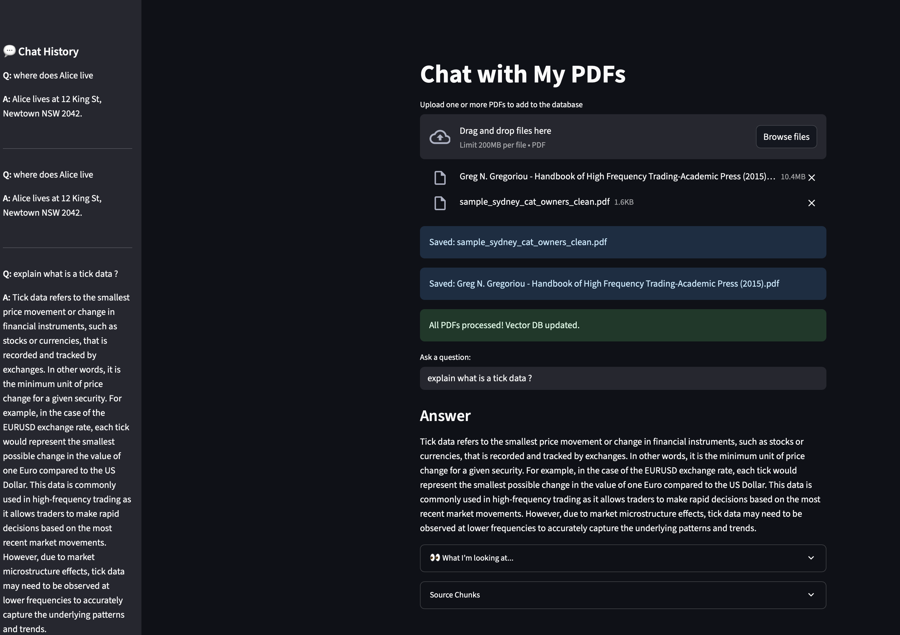

# 📚 Chat With My PDFs — Local, Private, Free

Implements a privacy-focused, fully local RAG pipeline (Retrieval-Augmented Generation) for PDF semantic search & chat — all offline.

---

## What this project does

- Lets you upload **one or more PDFs**, parse them locally, and search them semantically.
- Extracts plain text, tables, and performs OCR if needed.
- Embeds each chunk using a lightweight **locally-run** SentenceTransformer.
- Stores embeddings in a **FAISS** vector database for fast similarity search.
- Uses **Ollama** to run a **local LLM** (like Mistral or Llama3) that answers your questions *using only your PDFs*.
- Runs fully offline — no cloud APIs — your PDFs stay private.
- Current version returns the top 3 closest matches with full chunk context.

---

## Example: What a chunk looks like

```json
{
  "pdf": "pdfs/ATOMS-AND-MOLECULES.pdf",
  "page": 5,
  "chunk_id": "text_0",
  "type": "text",
  "content": "Dalton's Atomic Theory states that all matter is made up of indivisible atoms..."
}
```

Each chunk is embedded into the vector store for semantic search.
When you query, you get back the top chunks with their source info — so you can trace results back to the exact page in your PDF.

---

## How Ollama fits in

1. **Set up Ollama**:  
   - Installed with `curl -fsSL https://ollama.com/install.sh | sh`  
   - Pulled a local model: `ollama pull mistral` or `ollama pull llama3`  
   - Tested standalone:  
     ```bash
     ollama run mistral
     ```

2. **Integrated with the app**:  
   - The `ollama` Python client connects to `localhost:11434`.
   - When you ask a question, your local vector DB finds the top chunks.
   - The top chunks are used as **context** in the prompt.
   - Ollama answers *only* from that context — no internet calls.

---

## How Streamlit builds the UI

Your local app uses [Streamlit](https://streamlit.io/) to run like a mini web app:
- **PDF uploader**: drag & drop one or more PDFs.
- Shows **spinner/progress** while parsing, chunking & embedding.
- **Ask a question**: simple text box with a “thinking…” spinner.
- **Prompt inspector**: shows what context the LLM sees.
- **Source Chunks**: see which text chunks answered your question.
- **Sidebar chat history**: so you can trace what you asked and what it answered.

---

## Project structure

```
chat-with-my-pdf/
├── app.py                  # Your Streamlit web app
├── src/
│   ├── parser.py           # Extracts text, tables, OCR
├── pdfs/                   # PDFs you upload go here (local only)
├── faiss.index             # Your local vector DB
├── chunks_metadata.json    # Metadata to trace chunks to pages
├── requirements.txt
├── .gitignore
└── README.md
```

---

## How to run it

### 1️⃣ Clone & set up your virtual environment

```bash
git clone https://github.com/Mrunmoy/chat-with-my-pdf.git
cd chat-with-my-pdf

python3 -m venv venv
source venv/bin/activate

pip install -r requirements.txt
```

---

### 2️⃣ Run Ollama in the background

```bash
ollama serve
```
Or use the default `systemd` service if installed automatically.

---

### 3️⃣ Start your Streamlit app

```bash
streamlit run app.py
```

It will open [http://localhost:8501](http://localhost:8501) — your local chat window.

---

### 4️⃣ Upload, chat, repeat!

- Drag in one or more PDFs.
- Watch the spinner as they get parsed & chunked.
- A new vector DB is built every time.
- Ask any question — your local LLM answers using your PDFs only.

---

## Example: Local pipeline in action



---

## Why this is private

- Your PDFs, index, and chunks stay local.
- Your `.gitignore` ensures you never commit private `pdfs/`, `faiss.index`, or `chunks_metadata.json`.
- Ollama runs your LLM offline.

---

## Built with

- [PyMuPDF](https://pymupdf.readthedocs.io/) — PDF parsing
- [pdfplumber](https://github.com/jsvine/pdfplumber) — Tables
- [pytesseract](https://github.com/madmaze/pytesseract) — OCR
- [sentence-transformers](https://www.sbert.net/) — Local embeddings
- [FAISS](https://github.com/facebookresearch/faiss) — Local vector DB
- [Ollama](https://ollama.com) — Run local LLMs
- [Streamlit](https://streamlit.io/) — Web UI

---

## ⚖️ License
MIT — for personal learning and research.  
Respect any copyright for your own PDFs.

---

That’s it! 📚✨  
**Upload → Process → Chat → Learn — all local, all yours.**

